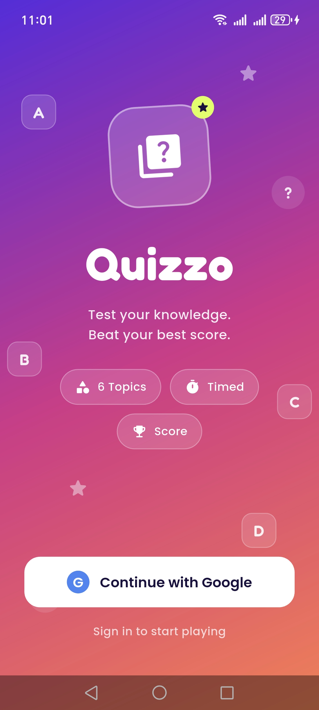
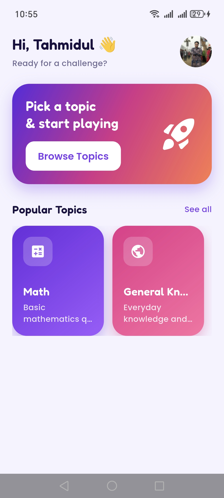
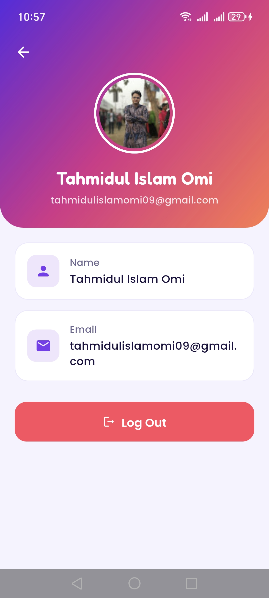
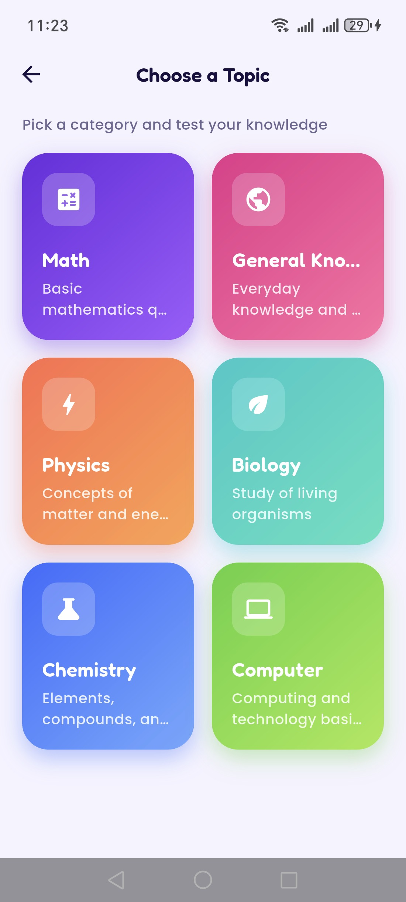
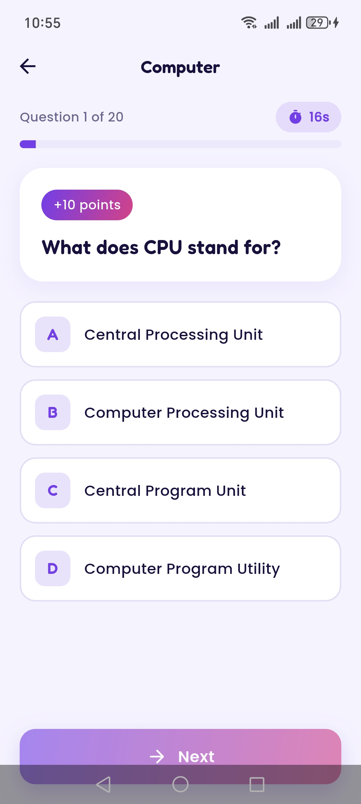
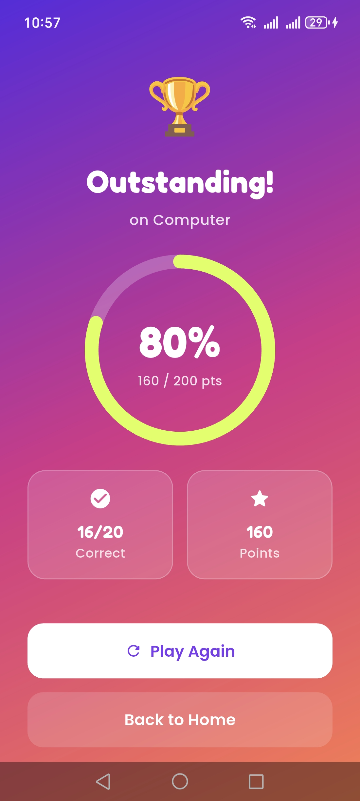

# 🎯 Quizzo — Flutter Quiz App with Google Authentication

Quizzo is a playful, modern quiz application built with Flutter. Sign in with
Google, browse quiz categories, answer timed questions, and see how you scored.

---

## ✨ Features

- 🔐 **Google Sign-In** via Firebase Authentication — login required before playing
- 📚 **Categories** fetched live from the API
- ⏱️ **Timed quizzes** — a per-question countdown (bonus feature)
- ✅ **Instant answer feedback** — correct/wrong highlighting with points
- 🏆 **Result screen** — score ring, performance message, and stats
- 👤 **Profile screen** — name, email, and profile picture from the Google account
- 🔄 **Loading & error states** with retry across every network screen
- 🎨 **Unique UI** — sunset gradient identity, Fredoka branding, animated motifs

---

## 📱 Screenshots

<div align="center">

### 🔐 Authentication & Home
<table>
  <tr>
    <td align="center">
      
      <br/>
      <b>Login Screen</b>
      <br/>
      <sub>Google Sign-In with animated UI</sub>
    </td>
    <td align="center">
      
      <br/>
      <b>Home Dashboard</b>
      <br/>
      <sub>Category preview and navigation</sub>
    </td>
    <td align="center">
      
      <br/>
      <b>Profile Screen</b>
      <br/>
      <sub>User info and logout</sub>
    </td>
  </tr>
</table>

### 📚 Quiz Experience
<table>
  <tr>
    <td align="center">
      
      <br/>
      <b>Categories</b>
      <br/>
      <sub>Browse all quiz topics</sub>
    </td>
    <td align="center">
      
      <br/>
      <b>Quiz Screen</b>
      <br/>
      <sub>Timed questions with live countdown</sub>
    </td>
    <td align="center">
      
      <br/>
      <b>Result Screen</b>
      <br/>
      <sub>Score ring with performance stats</sub>
    </td>
  </tr>
</table>

</div>

---

## 🛠️ Tech Stack

- **Flutter** (Material 3)
- **Firebase Auth** + **google_sign_in** — authentication
- **Provider** — state management
- **http** — API requests
- **google_fonts** (Poppins + Fredoka), **cached_network_image**

---

## 🧱 Architecture

Clean, layered structure with a clear separation of concerns:

```
lib/
├── core/            # theme, constants, shared enums, page transitions
├── models/          # Category, Question (JSON parsing)
├── services/        # ApiService, AuthService (+ typed exceptions)
├── providers/       # AuthProvider, CategoryProvider, QuizProvider
├── widgets/         # reusable UI (buttons, cards, states, option tile)
└── screens/         # login, home, category, quiz, result, profile
```

- **UI** reads state from **Providers**, which call **Services**, which return **Models**.
- Quiz logic (selection locking, scoring, timer) is centralized in `QuizProvider`.

---

## 🔌 API

Data is fetched from the provided quiz API using the `http` package.

- `GET /api/v1/categories` — list of categories
- `GET /api/v1/categories/{categoryId}/questions` — questions for a category

API docs: https://sadiks-quiz-apihub.lovable.app/api-docs

---

## 🚀 Getting Started

### Prerequisites
- Flutter SDK (3.44+)
- An Android device or emulator

### Run

```bash
flutter pub get
flutter run
```

### Firebase note
Google Sign-In requires a Firebase Android app configured with this project's
package name (`com.example.quiz_application`) and the debug **SHA-1**
fingerprint. The `android/app/google-services.json` is included. To run with
your own Firebase project, replace that file and add your SHA-1 in the Firebase
console (Authentication → Google must be enabled).

---

## 📦 Build the APK

```bash
flutter build apk --split-per-abi
```

Output: `build/app/outputs/flutter-apk/`

---

## 👤 Author

Tahmidul Islam Omi
